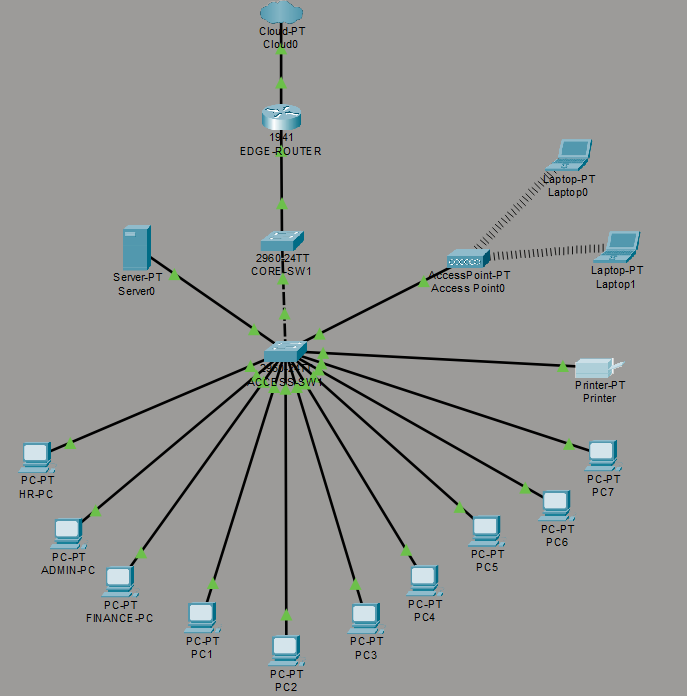
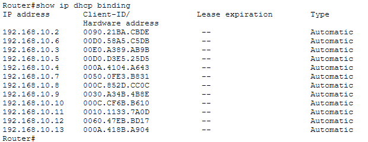
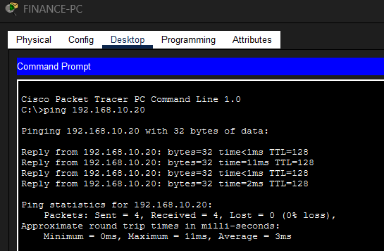
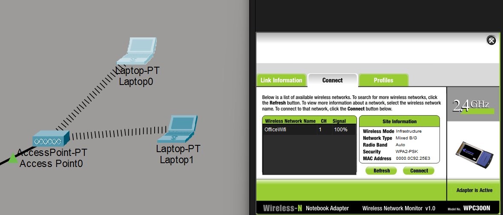
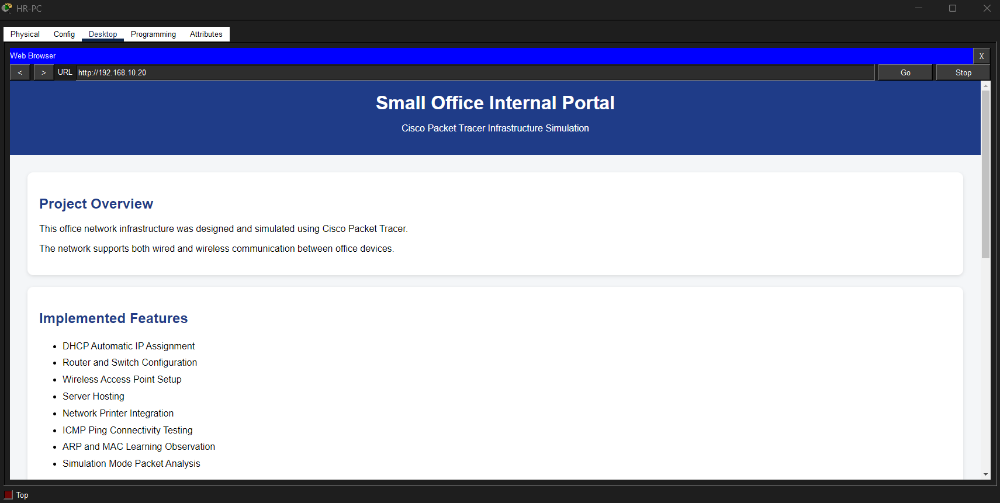
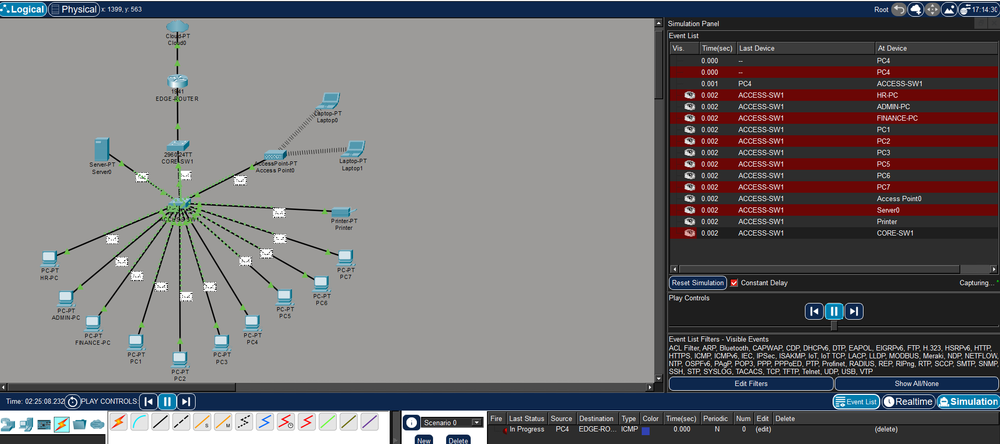

Small Office Network Simulation using Cisco Packet Tracer

# Project Overview:

This project simulates a small office network infrastructure using Cisco Packet Tracer.

The network supports both wired and wireless communication and demonstrates core networking concepts such as DHCP, switching, routing, server hosting, and packet flow analysis.

# Features Implemented:

- DHCP Automatic IP Assignment
- Router Configuration
- Core and Access Switches
- Wireless Access Point
- Wired and Wireless Clients
- Network Printer
- Web Server Hosting
- Ping Connectivity Testing
- ARP and MAC Learning Observation
- Simulation Mode Packet Analysis

# Devices Used:

|     Device    |    Count   |
|  ------------ | -----------|
| Router        |     1      |
| Core Switch   |     1      |
| Access Switch |     1      |
| PCs           |     10     |
| Laptops       |     2      |
| Server        |     1      |
| Printer       |     1      |
| Access Point  |     1      |

# Network Information:

|  Component   |    Address      |
| -----------  |  -----------    |
| Gateway      | 192.168.10.1    |
| DHCP Network | 192.168.10.0/24 |
| Server IP    | 192.168.10.20   |
| SSID         | OfficeWiFi      | 

# Connectivity Tests:

- PC ↔ PC 
- Laptop ↔ PC 
- PC ↔ Router 
- Laptop ↔ Server 
- PC ↔ Printer 

# Concepts Learned:

- DHCP
- ARP
- MAC Address Learning
- ICMP/Ping
- Switching
- Routing
- Wireless Networking
- Basic Server Hosting

# screenshots:

Network Topology: 

Router DHCP Configuration: 

Successful Connectivity Test: 

Wireless Connectivity: 

Office Portal: 

Simulation Mode: 

